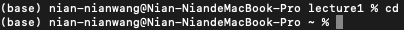
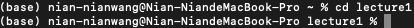
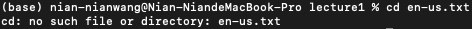

# Lab Report 1
## `cd`

absolute path: `(base) nian-nianwang@Nian-NiandeMacBook-Pro lecture1 % `
why: without any arguments, it sets working directory back to the home directory
error: not an error

absolute path: `(base) nian-nianwang@Nian-NiandeMacBook-Pro ~ %`
why: the directory `lecture1` exists under the home directory and directs to `lecture1`
error: not an error, it was successful

absolute path: `(base) nian-nianwang@Nian-NiandeMacBook-Pro lecture1 %`
why: directory is not changed and threw an error because a file is not a directory for `cd` command
error: it is an error, `cd` doesn't direct to a file directory

## `ls`

## `cat`
