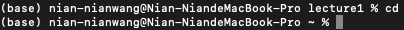

# Lab Report 1
## `cd`
  
Absolute path: `/Users/nian-nianwang/lecture1`  
Why: without any arguments, it sets working directory back to the home directory  
Error: not an error

  
Absolute path: `/Users/nian-nianwang`  
Why: the directory `lecture1` exists under the home directory and directs to `lecture1`  
Error: not an error

  
Absolute path: `/Users/nian-nianwang/lecture1`  
Why: directory is not changed and threw an error because a file is not a directory for `cd` command  
Error: it is an error, `cd` doesn't direct to a file directory

## `ls`
  
Absolute path: `/Users/nian-nianwang/lecture1`  
Why: without any arguments, it lists all the files in the current directory, which is `lecture1`  
Error: not an error

  
Absolute path: `/Users/nian-nianwang/lecture1`  
Why: specifying the path to `messages` lists out the files in the directory `messages` instead of current directory  
Error: not an error

  
Absolute path: `/Users/nian-nianwang/lecture1`  
Why: the pathname is a file, `ls` displays the specific file  
Error: not an error

## `cat`
  
Absolute path: `/Users/nian-nianwang/lecture1`  
Why: without any arguments, it will just return the input string  
Error: it is an error, it doesn't read any file

  
Absolute path: `/Users/nian-nianwang/lecture1`  
Why: we provided a directly instead of a file and the directory cannot be read like a text file  
Error: it is an error, a directly cannot be read

  
Absolute path: `/Users/nian-nianwang/lecture1`  
Why: we provided a file and the en-us.txt file was successfully read, returning the string in the text file  
Error: not an error

