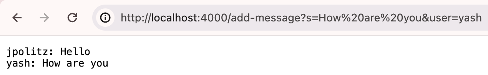

# Lab Report 2

## Part 1
ChatServer.java code:
```
import java.io.IOException;
import java.net.URI;

class Handler implements URLHandler {
    // The one bit of state on the server: a number that will be manipulated by
    // various requests.
    int num = 0;
    String message = "";

    public String handleRequest(URI url) {
        if (url.getPath().equals("/")) {
            return "";
        } else {
            if (url.getPath().contains("/add-message")) {
                String[] parameters = url.getQuery().split("&");
                String[] values = new String[parameters.length];
                for (int i = 0; i < parameters.length; i++) {
                    String[] params = parameters[i].split("=");
                    values[i] = params[1];
                }
                message = message.concat(String.format("%s: %s\n", values[1], values[0]));
                return message;
            }
            return "404 Not Found!";
        }
    }
}

class ChatServer {
    public static void main(String[] args) throws IOException {
        if(args.length == 0){
            System.out.println("Missing port number! Try any number between 1024 to 49151");
            return;
        }

        int port = Integer.parseInt(args[0]);

        Server.start(port, new Handler());
    }
}

```

Screenshots of using /add-message:
 <br>
 <br>
