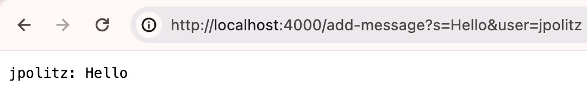
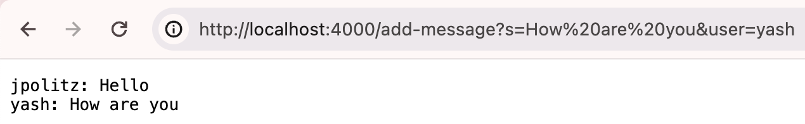
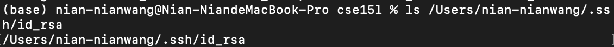
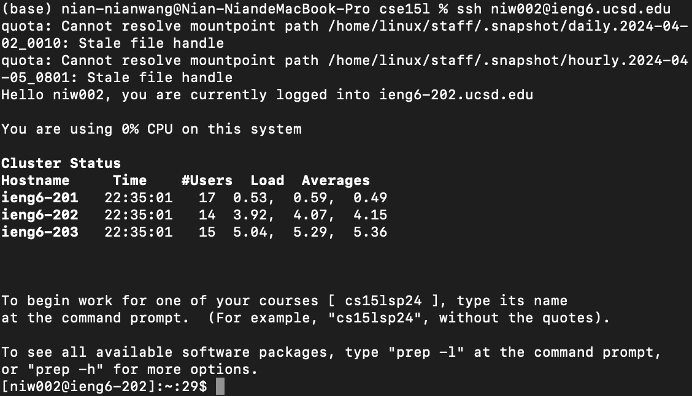

# Lab Report 2

## Part 1
### 1.1 ChatServer.java code:
```
import java.io.IOException;
import java.net.URI;

class Handler implements URLHandler {
    // The one bit of state on the server: a number that will be manipulated by
    // various requests.
    String message = "";

    public String handleRequest(URI url) {
        if (url.getPath().equals("/")) {
            return "";
        } else {
            if (url.getPath().contains("/add-message")) {
                String[] parameters = url.getQuery().split("&");
                String[] values = new String[parameters.length];
                for (int i = 0; i < parameters.length; i++) {
                    String[] params = parameters[i].split("=");
                    values[i] = params[1];
                }
                message = message.concat(String.format("%s: %s\n", values[1], values[0]));
                return message;
            }
            return "404 Not Found!";
        }
    }
}

class ChatServer {
    public static void main(String[] args) throws IOException {
        if(args.length == 0){
            System.out.println("Missing port number! Try any number between 1024 to 49151");
            return;
        }

        int port = Integer.parseInt(args[0]);

        Server.start(port, new Handler());
    }
}

```

### 1.2 Screenshots of using /add-message:
 <br>
Which methods in your code are called? <br>
`handleRequest` was called. <br>
What are the relevant arguments to those methods, and the values of any relevant fields of the class? <br>
The most important argument is `url` for getting the query part of the url. `parameters` was essential to extract user information and message. <br>
How do the values of any relevant fields of the class change from this specific request? If no values got changed, explain why. <br>
The value is updated for `message` from an empty string to the desired string format with username and message. <br>

 <br>
Which methods in your code are called? <br>
`handleRequest` was called. <br>
What are the relevant arguments to those methods, and the values of any relevant fields of the class? <br>
The relevant argument is `url` for the method to extract information from the url. `message` is important to save string information. <br>
How do the values of any relevant fields of the class change from this specific request? If no values got changed, explain why.
`message` was updated with the concatenation of the new information provided by a new input to the URL while saving previous input information.

## Part 2
1.  <br>
2.  <br>
3.  <br>

## Part 3
What we have been doing in lab week 2 and 3 are completely new to me. It was super cool to be how when I hosted a website while connected to the ieng6 server. My partner, who was also connected to the ieng6 server was able to access the web server, increment/add numbers for the website through modifying the url and I was able to see the changes when I refreshed the website later. I noticed how I have always been ignorant to urls where it actually are far more complex than I ever knew and consists a lot of important information.
