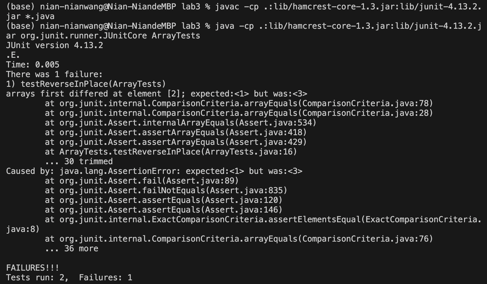

# Lab Report 3
## Part 1 - Bugs
### 1.1 & 1.2

Failure-inducing Test:
```
public class ArrayTests {
        @Test 
	public void testReverseInPlace() {
            int[] input2 = {1, 2, 3};
            ArrayExamples.reverseInPlace(input2);
            assertArrayEquals(new int[]{3, 2, 1}, input2);
	}
 }
```
Passed Test:
```
public class ArrayTests {
	@Test 
	public void testReverseInPlace() {
            int[] input1 = { 3 };
            ArrayExamples.reverseInPlace(input1);
            assertArrayEquals(new int[]{ 3 }, input1);
        }
 }
```

### 1.3 Output

Error Message:

```
(base) nian-nianwang@Nian-NiandeMBP lab3 % javac -cp .:lib/hamcrest-core-1.3.jar:lib/junit-4.13.2.jar *.java
(base) nian-nianwang@Nian-NiandeMBP lab3 % java -cp .:lib/hamcrest-core-1.3.jar:lib/junit-4.13.2.jar org.junit.runner.JUnitCore ArrayTests
JUnit version 4.13.2
.E.
Time: 0.005
There was 1 failure:
1) testReverseInPlace(ArrayTests)
arrays first differed at element [2]; expected:<1> but was:<3>
        at org.junit.internal.ComparisonCriteria.arrayEquals(ComparisonCriteria.java:78)
        at org.junit.internal.ComparisonCriteria.arrayEquals(ComparisonCriteria.java:28)
        at org.junit.Assert.internalArrayEquals(Assert.java:534)
        at org.junit.Assert.assertArrayEquals(Assert.java:418)
        at org.junit.Assert.assertArrayEquals(Assert.java:429)
        at ArrayTests.testReverseInPlace(ArrayTests.java:16)
        ... 30 trimmed
Caused by: java.lang.AssertionError: expected:<1> but was:<3>
        at org.junit.Assert.fail(Assert.java:89)
        at org.junit.Assert.failNotEquals(Assert.java:835)
        at org.junit.Assert.assertEquals(Assert.java:120)
        at org.junit.Assert.assertEquals(Assert.java:146)
        at org.junit.internal.ExactComparisonCriteria.assertElementsEqual(ExactComparisonCriteria.java:8)
        at org.junit.internal.ComparisonCriteria.arrayEquals(ComparisonCriteria.java:76)
        ... 36 more

FAILURES!!!
Tests run: 2,  Failures: 1 ```
```


### 1.4 Code

Buggy Code:
```
public class ArrayExamples { 

  // Changes the input array to be in reversed order
  static void reverseInPlace(int[] arr) {
    for(int i = 0; i < arr.length; i += 1) {
      arr[i] = arr[arr.length - i - 1];
    }
  }
}
```

Fixed Code:
```
public class ArrayExamples { 

  // Changes the input array to be in reversed order
  static void reverseInPlace(int[] arr) {
    for(int i = 0; i < arr.length / 2; i += 1) {
      int toSwap = arr[i];
      arr[i] = arr[arr.length - i - 1];
      arr[arr.length - i - 1] = toSwap;
    }
  }
}
```

### 1.5

The fixed code loops through half of the Array. This loop is designed to only iterate through half of the array because when swapping elements to reverse the array, we only need to go halfway to avoid re-reversing elements. 

Within the loop, it stores the value of the element at index `i` in a variable named `toSwap`. It assigns the value of the element at index `arr.length - i - 1`, which corresponds to the position of the element in the array that is symmetrically opposite to the element at index `i`, to the element at index i. The element at index `arr.length - i - 1` is then assigned to the value `toSwap`, which was the original value of the element at index `i`.

This fixed code effectively swaps the first half of the array with the second half.

## Part 2 - `grep` Command Research

### 1. `-i`

**Source:**
https://docs.rackspace.com/docs/use-the-linux-grep-command

**Command:**
```
grep -i research technical/biomed/*.txt
```

**Output:**
```
technical/biomed/1472-6874-2-13.txt:        the primary products of research [ 8 9 ] . Figure 1, though
technical/biomed/1472-6874-2-13.txt:          Endocrine Research Laboratory. The analyses for E 
technical/biomed/1472-6874-2-13.txt:        typical purposes of epidemiological research because the
technical/biomed/1472-6874-2-13.txt:        results of typical epidemiological research center on
technical/biomed/1472-6874-2-13.txt:        researchers' capacity to control. For example, the validity
technical/biomed/1472-6874-2-13.txt:        useful for designing future research projects exploring the
technical/biomed/1472-6874-2-13.txt:        from the Cancer Center Support grant to the Cancer Research
technical/biomed/1472-6882-1-10.txt:        hunting success. During the research some hunters claimed
technical/biomed/1472-6882-1-10.txt:          The research area is located in Guayaguayare on
technical/biomed/1472-6882-1-10.txt:          conducted research with one group of seven hunters based
technical/biomed/1472-6882-1-10.txt:          mixed race. This research included participant
technical/biomed/1472-6882-1-10.txt:          to hunters (and researchers) which may explain some of
technical/biomed/1472-6882-1-10.txt:          their bush medicine remedies. One research hazard was the
...
```

**Function:**
In this example, using `-i` ignores the text files and texts in `biomed` that does not contain the word `research` and displays all the files and lines where `research` appears. This is really useful for what we normally do command+f when looking through web pages and files, but case case insensitive.

**Command:**
```
grep -i police technical/911report/*.txt
```

**Output:**
```
technical/911report/chapter-1.txt:    At 8:52, in Easton, Connecticut, a man named Lee Hanson received a phone call from his son Peter, a passenger on United 175. His son told him: "I think they've taken over the cockpit-An attendant has been stabbed- and someone else up front may have been killed. The plane is making strange moves. Call United Airlines-Tell them it's Flight 175, Boston to LA." Lee Hanson then called the Easton Police Department and relayed what he had heard.
technical/911report/chapter-1.txt:    Shortly after 9:00, Indianapolis Center started notifying other agencies that American 77 was missing and had possibly crashed. At 9:08, Indianapolis Center asked Air Force Search and Rescue at Langley Air Force Base to look for a downed aircraft. The center also contacted the West Virginia State Police and asked whether any reports of a downed aircraft had been received. At 9:09, it reported the loss of contact to the FAA regional center, which passed this information to FAA headquarters at 9:24.
technical/911report/chapter-10.txt:                of a military police lead vehicle and a van; the proposed briefing theater had no
technical/911report/chapter-11.txt:                officials-local airport managers and local police departments- who had not seen such
technical/911report/chapter-11.txt:                concerned citizens. Representatives of the Justice Department, the FAA, local police
technical/911report/chapter-12.txt:                violent extremism. According to Karachi's police commander, there are 859 madrassahs
technical/911report/chapter-12.txt:            The country's vast unpoliced regions make Pakistan attractive to extremists seeking
technical/911report/chapter-12.txt:                with al Qaeda. Saudi police are regularly being killed in shootouts with terrorists.
...
```

**Function:**
This will be useful for people who would like to research particularly on police involvement in 911 as the command searches for where police appears in the text files about 911report. They don't have to scroll through all files but can quickly query the areas where the information they want may be.

### 2. `-E`

**Source:**
https://www.geeksforgeeks.org/grep-command-in-unixlinux/

**Input:**
```
grep -E "[0-9]" technical/biomed/*.txt
```

**Output:**
```
technical/biomed/rr172.txt:        4 hours in minimal Eagle's medium with Earle's salts to
technical/biomed/rr172.txt:        consisted of untreated controls, treatment with 50 ng/ml
technical/biomed/rr172.txt:        TNF-α and treatment with 0.4 μg/ml CSC. After treatments,
technical/biomed/rr172.txt:        from the wells and centrifuged 1 min at 12,000 × 
technical/biomed/rr172.txt:        g. Aliquots of 20 μl of each lysate
technical/biomed/rr172.txt:        to moderate doses of CSC by activating both the ERK1/2 and
technical/biomed/rr172.txt:        kinase; MEK-1 = MAPK kinase; NFκB = nuclear factor-kappa B;
technical/biomed/rr191.txt:        hyperinsulinemic [ 1 ] . An increased incidence of neonatal
technical/biomed/rr191.txt:        infants of diabetic mothers [ 1 ] . RDS is caused by
technical/biomed/rr191.txt:        lung development [ 2 ] . It has been proposed that high
technical/biomed/rr191.txt:        the diabetic mother [ 3 ] .
technical/biomed/rr191.txt:        (~80%), cholesterol (~10%), and proteins (~10%), functions
technical/biomed/rr191.txt:        end expiration [ 4 ] . The surfactant-associated proteins
technical/biomed/rr191.txt:        regulated [ 4 ] . We, and others, have shown that the SP-A
technical/biomed/rr191.txt:        significantly decreased [ 1 ] . Low SP-A levels in amniotic
technical/biomed/rr191.txt:        neonatal RDS [ 5 ] . Our previous studies have shown that
technical/biomed/rr191.txt:        transcription [ 6 7 ] .
...
```
**Function:**
This command is particularly helpful when working with text files that contain numerical data, such as log files, reports, or experiment outcomes, searching for numbers can help with extracting and analyzing relevant information.

**Input:**
```
grep -E "women" technical/government/About_LSC/*.txt  
```

**Output:**
```
technical/government/About_LSC/ONTARIO_LEGAL_AID_SERIES.txt:would no longer exist. But as we all know today that young women
technical/government/About_LSC/Progress_report.txt:women in our programs has not diminished in spite of a decreasing
technical/government/About_LSC/Progress_report.txt:number of programs (from reconfiguration) the number of women
technical/government/About_LSC/Special_report_to_congress.txt:elderly and for battered women under the following specific
technical/government/About_LSC/Special_report_to_congress.txt:expand services to women and children in potentially abusive
technical/government/About_LSC/Special_report_to_congress.txt:estimate that between one and four million American women
technical/government/About_LSC/Special_report_to_congress.txt:were women, most of them mothers with children. Although the named
technical/government/About_LSC/Strategic_report.txt:diminish the percent of minorities and women in leadership
technical/government/About_LSC/Strategic_report.txt:directors remained virtually unchanged, and the number of women
technical/government/About_LSC/Strategic_report.txt:Unfortunately, the data also showed that the number of women
technical/government/About_LSC/diversity_priorities.txt:Program staff was less diverse. Fewer women worked in
technical/government/About_LSC/diversity_priorities.txt:retaining and promoting people of color, women, people with
technical/government/About_LSC/diversity_priorities.txt:greater gender diversity and pursued activities to bring women into
technical/government/About_LSC/diversity_priorities.txt:Our staffs include more women, people with disabilities,
technical/government/About_LSC/diversity_priorities.txt:color, women, people with disabilities, gays and lesbians and other
technical/government/About_LSC/diversity_priorities.txt:minorities and women (and younger staff) to advance? How do we
technical/government/About_LSC/diversity_priorities.txt:and women. In the Present we recognize that barriers are not
technical/government/About_LSC/diversity_priorities.txt:influx of immigrants. There will be more women, children and
...
```
**Function:**
I was expecting there to be documentation about improving diversity in government documents. This is more case sensitive than when using `-i` to use regular expressions to find places where "women" is exactly mentioned. From the extracted text, I can already have a brief idea of the government having the idea of being more inclusive and diverse.

### 3. `-A`

**Source:**
https://www.geeksforgeeks.org/grep-command-in-unixlinux/

**Input:**
```
grep -A 1 "women" technical/government/About_LSC/*.txt
```

**Output:**
```
technical/government/About_LSC/ONTARIO_LEGAL_AID_SERIES.txt:would no longer exist. But as we all know today that young women
technical/government/About_LSC/ONTARIO_LEGAL_AID_SERIES.txt-who started her life in legal services in 1975 full of hope and
--
technical/government/About_LSC/Progress_report.txt:women in our programs has not diminished in spite of a decreasing
technical/government/About_LSC/Progress_report.txt:number of programs (from reconfiguration) the number of women
technical/government/About_LSC/Progress_report.txt-leaders and leaders of color is small compared with their numbers
--
technical/government/About_LSC/Special_report_to_congress.txt:elderly and for battered women under the following specific
technical/government/About_LSC/Special_report_to_congress.txt-programs without financial eligibility information because these
--
technical/government/About_LSC/Special_report_to_congress.txt:expand services to women and children in potentially abusive
technical/government/About_LSC/Special_report_to_congress.txt-situations. Further, under its state planning initiative that
--
technical/government/About_LSC/Special_report_to_congress.txt:estimate that between one and four million American women
technical/government/About_LSC/Special_report_to_congress.txt-experience an assault by an intimate partner each year, and 3.3
--
...
```
**Function:**
After working on the command previously done with `-E` for "women" in government files, I realized I want to immediately read more about it. I found `-A n` to be helpful in providing more context directly instead of scrolling and searching through the txt files.

**Input:**
```
grep -A 1 "CIA" technical/911report/*.txt
```

**Output:**
```
technical/911report/chapter-8.txt:                and the CIA as to whether the Chechen rebels and Khattab were sufficiently
technical/911report/chapter-8.txt-                associated with a terrorist organization to constitute a "foreign power" for
--
technical/911report/chapter-8.txt:                the request on August 21. On August 24, the CIA also sent a cable to London and
technical/911report/chapter-8.txt-                Paris regarding "subjects involved in suspicious 747 flight training" that described
technical/911report/chapter-8.txt:                Moussaoui as a possible "suicide hijacker." On August 28, the CIA sent a request for
technical/911report/chapter-8.txt-                information to a different service of the British government; this communication
--
technical/911report/chapter-8.txt:            On September 4, the FBI sent a teletype to the CIA, the FAA, the Customs Service, the
technical/911report/chapter-8.txt-                State Department, the INS, and the Secret Service summarizing the known facts
--
technical/911report/chapter-8.txt:                because of a visa overstay and that the CIA was working the case with the FBI. Tenet
technical/911report/chapter-8.txt-                told us that no connection to al Qaeda was apparent to him at the time. Seeing it as
--
...
```
**Function:**
This identifies sections an passages within the text files that are directly related to the keyword. Very useful for extracting context around lines containing the keyword "CIA" from multiple text files and having a gist of the research findings and records behind the scenes. 

### 4. `-v`

**Source:**
https://docs.rackspace.com/docs/use-the-linux-grep-command

**Input:**

```
grep -n "CIA" technical/911report/*.txt | head -10
```

**Output:**
```
technical/911report/chapter-1.txt:580:    At the White House, the video teleconference was conducted from the Situation Room by Richard Clarke, a special assistant to the president long involved in counterterrorism. Logs indicate that it began at 9:25 and included the CIA; the FBI; the departments of State, Justice, and Defense; the FAA; and the White House shelter. The FAA and CIA joined at 9:40. The first topic addressed in the White House video teleconference-at about 9:40-was the physical security of the President, the White House, and federal agencies. Immediately thereafter it was reported that a plane had hit the Pentagon. We found no evidence that video teleconference participants had any prior information that American 77 had been hijacked and was heading directly toward Washington. Indeed, it is not clear to us that the video teleconference was fully under way before 9:37, when the Pentagon was struck.
technical/911report/chapter-10.txt:331:                proposed inserting CIA teams into Afghanistan to work with Afghan warlords who would
technical/911report/chapter-10.txt:332:                join the fight against al Qaeda.46These CIA teams would act jointly with the
technical/911report/chapter-10.txt:360:                the CIA.
technical/911report/chapter-10.txt:487:                1995 Manila air plot in crashing an explosives-laden plane into CIA headquarters,
technical/911report/chapter-10.txt:562:                    Qaeda and Taliban targets. In an innovative joint effort, CIA and Special
technical/911report/chapter-10.txt:588:            Within about two months of the start of combat operations, several hundred CIA
technical/911report/chapter-10.txt:595:                According to a senior CIA officer who helped devise the overall strategy, the CIA
technical/911report/chapter-11.txt:60:                Kansi, who in 1993 killed two CIA employees as they waited to go to work in Langley,
technical/911report/chapter-11.txt:153:            Whatever the weaknesses in the CIA's portraiture, both Presidents Bill Clinton and
...
```
**Function:**
As I previously used `-A n` to get more context, if the number of lines needed for context is unclear or just in the earlier stage of exploring the txt files, showing the lines where the specific keyword appears can be helpful to quickly locate where relevant information is.

**Input:**
```
grep -r -n "women" technical/government
```

**Output:**
```
technical/government/About_LSC/Progress_report.txt:945:women in our programs has not diminished in spite of a decreasing
technical/government/About_LSC/Progress_report.txt:946:number of programs (from reconfiguration) the number of women
technical/government/About_LSC/Strategic_report.txt:445:diminish the percent of minorities and women in leadership
technical/government/About_LSC/Strategic_report.txt:449:directors remained virtually unchanged, and the number of women
technical/government/About_LSC/Strategic_report.txt:454:Unfortunately, the data also showed that the number of women
technical/government/About_LSC/Special_report_to_congress.txt:322:elderly and for battered women under the following specific
technical/government/About_LSC/Special_report_to_congress.txt:590:expand services to women and children in potentially abusive
technical/government/About_LSC/Special_report_to_congress.txt:641:estimate that between one and four million American women
technical/government/About_LSC/Special_report_to_congress.txt:654:were women, most of them mothers with children. Although the named
technical/government/About_LSC/ONTARIO_LEGAL_AID_SERIES.txt:22:would no longer exist. But as we all know today that young women
technical/government/About_LSC/diversity_priorities.txt:92:Program staff was less diverse. Fewer women worked in
technical/government/About_LSC/diversity_priorities.txt:117:retaining and promoting people of color, women, people with
technical/government/About_LSC/diversity_priorities.txt:138:greater gender diversity and pursued activities to bring women into
technical/government/About_LSC/diversity_priorities.txt:168:Our staffs include more women, people with disabilities,
technical/government/About_LSC/diversity_priorities.txt:215:color, women, people with disabilities, gays and lesbians and other
technical/government/About_LSC/diversity_priorities.txt:217:minorities and women (and younger staff) to advance? How do we
technical/government/About_LSC/diversity_priorities.txt:224:and women. In the Present we recognize that barriers are not
technical/government/About_LSC/diversity_priorities.txt:238:influx of immigrants. There will be more women, children and
technical/government/About_LSC/diversity_priorities.txt:298:few people of color, women, persons with disabilities, gays or
technical/government/About_LSC/diversity_priorities.txt:343:is critical to retaining women, people of color and other
technical/government/About_LSC/diversity_priorities.txt:407:among women and members of "disenfranchised groups" must be in
technical/government/About_LSC/diversity_priorities.txt:409:women managers and minority managers cannot be held to unreasonable
technical/government/About_LSC/diversity_priorities.txt:451:women, gays, lesbians, people of color, older people and people
technical/government/Env_Prot_Agen/final.txt:55:and women of child bearing age, may be reduced. This includes risks
technical/government/Env_Prot_Agen/final.txt:376:children of women who consume large amounts of fish during
technical/government/Env_Prot_Agen/nov1.txt:147:Children born to women who consume large amounts of
technical/government/Alcohol_Problems/Session2-PDF.txt:47:drinks/day for men and 2 or more drinks/day for women. The National
technical/government/Alcohol_Problems/Session2-PDF.txt:50:drinks/occasion for men ages 18 to 65. For women of all ages and
technical/government/Alcohol_Problems/Session2-PDF.txt:194:Several screens have been developed for pregnant women. Concern
technical/government/Alcohol_Problems/Session2-PDF.txt:250:Bradley reviewed nine studies with data on women's responses to
technical/government/Alcohol_Problems/Session2-PDF.txt:252:were the best tests for alcohol dependence among women. Their
technical/government/Alcohol_Problems/Session2-PDF.txt:254:better among black women than among white women. TWEAK per-formed
technical/government/Alcohol_Problems/Session2-PDF.txt:255:better than CAGE or AUDIT among white women. CAGE and AUDIT had low
technical/government/Alcohol_Problems/Session2-PDF.txt:257:among white women. We must be careful not to employ screening
technical/government/Alcohol_Problems/Session2-PDF.txt:261:addition to women, other subgroups such as adolescents, older
technical/government/Alcohol_Problems/Session2-PDF.txt:262:adults, pregnant women, psychiatric patients, and Spanish speakers
technical/government/Alcohol_Problems/Session2-PDF.txt:332:such as women,41 adolescents,54-59 and elders,60-64 needs to be
technical/government/Alcohol_Problems/Session2-PDF.txt:550:screening questionnaires in women. JAMA 1998;280:166-71.
technical/government/Gen_Account_Office/Testimony_cg00010t.txt:833:increased presence of women and minorities caused substantial
technical/government/Gen_Account_Office/pe1019.txt:2374:For example, in a basic research study of 40 low-income women,
technical/government/Gen_Account_Office/pe1019.txt:2387:women and why the incidence of mental health problems among them
technical/government/Gen_Account_Office/gg96118.txt:1545:Force-consist of about 1.5 million men and women on active duty, 1
technical/government/Gen_Account_Office/d01591sp.txt:1509:alive at age 82 and half of women reaching age 65 can expect to be
technical/government/Media/Targeting_Domestic_Violence.txt:86:main reasons women don't want to leave. Without a lawyer facing the
technical/government/Media/Targeting_Domestic_Violence.txt:88:intimidating. A lot of women don't even want to start the process
technical/government/Media/State_funding.txt:61:for battered women.
technical/government/Media/Barnes_new_job.txt:15:women escape domestic violence, Mauricio Vivero
technical/government/Media/Legal_Aid_in_Clay_County.txt:53:40 percent involved women who had been abused by violent husbands
technical/government/Media/Legal_Aid_in_Clay_County.txt:54:and were seeking divorces, Figgins said. Most of the women were
technical/government/Media/Legal_Aid_in_Clay_County.txt:63:about 75 percent of the women who come to her agency in search of
...
```
**Function:**
It can clearly show the specific files and the respective lines where the keyword appears. Just knowing the number of occurrences of every file and its line numbers in general can also guide to targeted reading of certain articles and paragraphs instead of jumping around the whole file.
