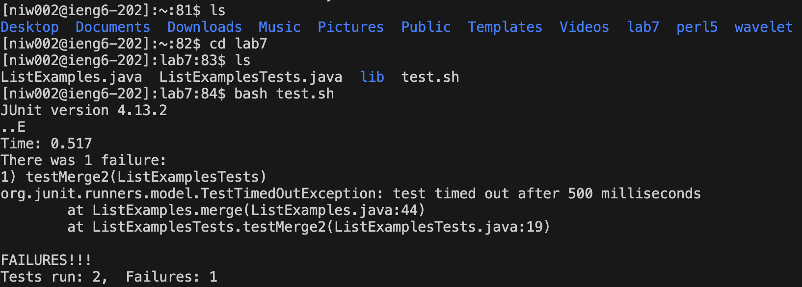

# Lab Report 4

1. log into remote machine ieng6: `ssh niw002@ieng6.ucsd.edu` + `<enter>` 
2. clone forked repository: `git clone` + `<command + C>` (ssh URL has been copied from github) 
3. run test: `ls` + `<enter>`, `cd lab7` + `<enter>`, `<up><up>` + `<enter>`, `bash test.sh` + `<enter>` I have to search and get to the right directory in order to find and run the test. 
4. 
5.
6. typed in `/index1` + `<enter>`
7. pressed `n` 9 times
8. pressed <right> 5 times
9. typed r2
10. :wq + <enter>
11. <up> two times in terminal history
