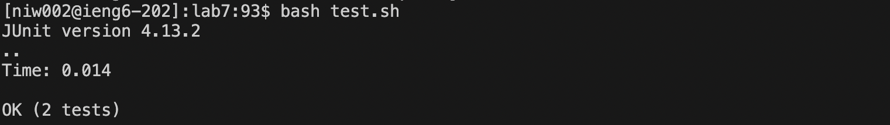
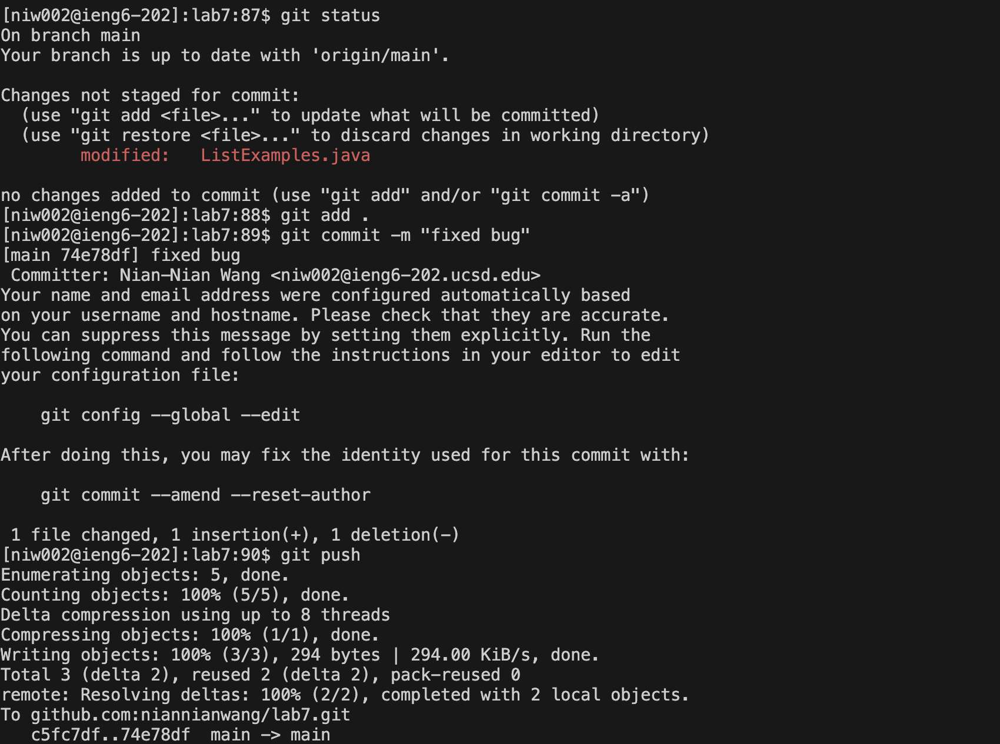

# Lab Report 4

1. log into remote machine ieng6: `ssh niw002@ieng6.ucsd.edu` + `<enter>` 
2. clone forked repository: `git clone` + `<command + C>` (ssh URL has been copied from github) 
3. run test: `ls` + `<enter>`, `cd lab7` + `<enter>`, `<up><up>` + `<enter>`, `bash test.sh` + `<enter>` I have to search and get to the right directory in order to find and run the test. 
4. edit code (vim): `vim` + `L` + `<tab>` + `.java` + `<enter>` Use vim to edit code from terminal. 
6. edit code (search): typed in `/index1` + `<enter>` We were told that we have to change the code from index1 to index2. I found using search in `vim` much more efficient than other commands when we know what we are looking for particularly. 
7. edit code (search): pressed `n` 9 times I was not sure where the index1 I needed to fix was, so I pressed `n` to go through all the `index1`s one by one.
8. edit code (search): pressed `<right>` 5 times
9. edit code (search): typed `r2` This was for replacing 1 to 2 with my cursor on top of `1` for `index1`. In this way, I don't need to go into insert mode and save some key presses.  
10. edit code (search): `:wq` + <enter> This was to save and quit. 
11. run test: `<up>` two times in terminal history to get to the previous time I ran `bash test.sh` 
12. git: `git status` + `<enter>`, `git add .` + `<enter>`, `git commit -m "fixed bug"` + `<enter>`, `git push` + `<enter>` standard git process to push updates on github 
